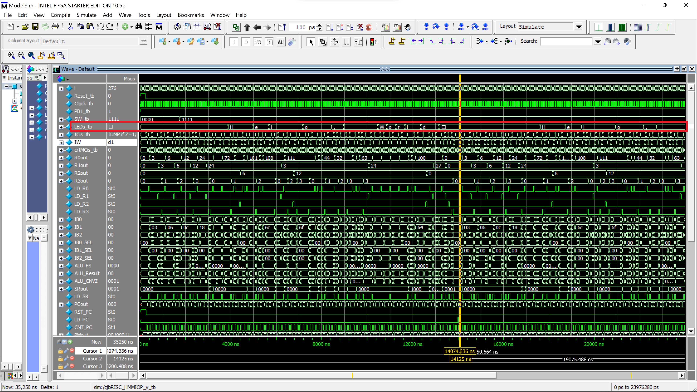

# cjbRISC

<!--
[![Contributors][contributors-shield]][contributors-url]
[![Forks][forks-shield]][forks-url]
[![Stargazers][stars-shield]][stars-url]
[![Issues][issues-shield]][issues-url]
[![MIT License][license-shield]][license-url] -->
[![LinkedIn][linkedin-shield]][linkedin-url]

|  |
|:--:|
| cjbRISC CPU saying hi! |

<!-- DESCRIPTION -->
  <p align="left">
    This is my Verilog implementation of an 8-bit Reduced Instruction Set Computer (RISC), designed to be implemented on an Altera FPGA. It implements basic arithmetic and logic functions and can be easily scaled to include more instructions with added complexity to the CPU, such as a multiplier in the Arithmetic/Logic Unit. Current programs I have written for it compute some random numbers, print out "Hello, World!" in ASCII, and simulate multiplication.
    <br />
    <a href="#usage"><strong>Jump to Usage»</strong></a>
    <br />
    <br />
    <!-- <a href="https://github.com/github_username/repo_name">View Demo</a> -->
    ·
    <a href="https://github.com/c-biancone/cjbRISC/issues">Report Bug / Request Feature</a>
    ·
  </p>

<!-- TABLE OF CONTENTS -->
<details open="open">
  <summary><h2 style="display: inline-block">Table of Contents</h2></summary>
  <ol>
    <li><a href="#background">Background</a></li>
    <li><a href="#my-design">My Design</a></li>
    <li>
      <a href="#getting-started">Getting Started</a>
      <ul>
        <li><a href="#prerequisites">Prerequisites</a></li>
        <li><a href="#cloning">Cloning</a></li>
      </ul>
    </li>
    <li><a href="#usage">Usage</a></li>
    <li><a href="#future">Future</a></li>
    <li><a href="#contact">Contact</a></li>
    <li><a href="#acknowledgements">Acknowledgements</a></li>
  </ol>
</details>

## Background
A Central Processing Unit (CPU) in its most basic form is a set of registers and combinational logic (ALU) that is controlled by a Control Unit in order to take in inputs, manipulate the data according to specified instructions, and output the result. It also has access to memory to store the data for later use.

| |
|:--:|
| <a href="https://en.wikipedia.org/wiki/Central_processing_unit#/media/File:ABasicComputer.gif">*A Basic Computer*</a> |
</br>

RISC processing is typically categorized by a CPU having fewer than 100 instructions in its architecture. They can typically perform the same functions as Complex Instruction Set computers (>100 instructions) with increased computing time. RISC has gained a lot of notoriety recently with developments by Si-Five's RISC-V free and open Instruction Set Architecture (ISA) as a means to combat the bloated instruction sets of x86 computing and achieve a more efficient use of the silicon CPU die. However, RISC is where computing started, before complex instructions could be implemented at the hardware level. This makes a custom RISC processor suitable as an introduction to complex digital system design.

## My Design

This RISC processor follows the Harvard computer architecture, which has separate pathways for instructions and data allowing for parallel load.

|  |
|:--:|
| <a href="https://en.wikipedia.org/wiki/Harvard_architecture">*Harvard Architecture*</a> |
</br>

 The I/O registers are Memory-Mapped, allowing the instructions used to access data memory also access I/O devices. It has 3 internal busses - two for loading operands and one write-back bus that also handles memory addressing. The ALU and its lower-level primitives are described structurally to achieve the most efficient hardware implementation after compilation.

I employed the Algorithmic State Machine method to design the functionality of the CPU:

|  |
|:--:|
</br>

This was used to develop the <a href="https://github.com/c-biancone/cjbRISC/verilog_RISC/cjbRISC_HMMIOP_CU_v.v">Control Unit</a> for the CPU, which generates the necessary signals to correctly control the <a href="https://github.com/c-biancone/cjbRISC/verilog_RISC/cjbRISC_HMMIOP_DP_v.v">Data Path</a> during each Machine Cycle. A block diagram of the Data Path is shown here, detailing the Register File, ALU, Program Memory, Data Memory, and I/O:

|  |
|:--:|
</br>

This is the as-compiled version shown in the Netlist Viewer:

|  |
|:--:|

The address for the Memory-Mapped I/O is calculated by sign extending the output from the program memory and adding it with a "memory offset" brought in from the writeback bus.


#### Built With:

* Quartus Prime 18.1


<!-- GETTING STARTED -->
## Getting Started

To get a local copy up and running follow these simple steps:

### Prerequisites

* <a href="https://fpgasoftware.intel.com/?edition=lite">Intel Quartus Prime Lite</a>

To implement CPU in hardware:
* Altera FPGA dev board (Terasic DE0-Nano used here)


### Cloning

1. Clone the repo into the desired directory
   ```sh
   git clone https://github.com/c-biancone/cjbRISC.git
   ```
2. Navigate to the <a href="https://github.com/c-biancone/cjbRISC/tree/main/cjbRISC_Quartus">cjbRISC_Quartus</a> folder and open the `.qpf` file.


<!-- USAGE EXAMPLES -->
## Usage

1. Once Quartus has loaded the file, be sure to set the parameters for your specific board. Navigate to Assignments > Device. In my case I select the Cyclone IV E family and board EP4CE22F17C6.

2. Set ModelSim-Altera as the EDA tool simulation environment and make sure `cjbRISC_HMMIOP_v_tb.v` is set as the testbench to compile.

3. To select the program to run, navigate to the <a href="https://github.com/c-biancone/cjbRISC/tree/main/programs">programs</a> directory and copy the desired program to <a href="https://github.com/c-biancone/cjbRISC/tree/main/cjbRISC_Quartus/simulation/ModelSim">cjbRISC_Quartus/simulation/ModelSim</a>. Change `Line 86` in `cjb_PM_HMMIOP_v` to include the name of the correct program.
     *  `cjb_PM_HMMIOP_P1` performs some random operations to test the functionality of all instructions.
     *  `cjb_MUL_HMMIOP` simulates multiplication.
     *  `cjb_PM_HMMIOP_P2-Hello_World` computes and prints out "Hello, World!" in ASCII code on the 8 LEDs of the FPGA board.

4. To run only a simulation, set the top-level entity to `cjbRISC_HMMIOP_V.v` and run the Analysis and Synthesis. Once this is done, navigate to Tools > Run Simulation Tool > RTL Simulation.

5. To compile for hardware implementation, be sure to set the correct pin assignments for your FPGA. Set the top-level entity to `cjbRISC_HMMIOP_v.v` or `cjbRISC_HMMIOP_v_FPGA.v` if clock division is needed. Once this is complete the FPGA can be programmed and the CPU will run.

##### Note:
* Lines 253 and 266 of `cjbRISC_HMMIOP_CU.v` determine which addresses of the Memory-Mapped I/O will also output on the store instruction. This needs to be at least the last 4 of the 1024 memory addresses, so change this value in the condition to at most `0x3FC`.


## Future
In its current state, this CPU works properly for all of the instructions it is intended to implement. I am considering implementing a multiplication unit, pipelined or not, which would significantly speed up many operations; this will require handling for overflow of results over 8 bits in length and appropriate clock synchronization to capture the correct output.

My immediate plans for this project are to write my own assembler to generate the `.mif` files from simple Assembly code targeted toward this architecture. This will make it much easier to write programs compared to manually entering the machine code. I was given a basic C-based assembler to work with this ISA, but it does not work for all instructions and can be improved upon. I plan on writing my own version in C++ to allow for easier lexical analysis and implement correct address offset handling for the Jump, Load, and Store instructions.


<!-- CONTACT -->
## Contact

Chris Biancone - [email](chris.biancone@gmail.com)

Project Link: [https://github.com/c-biancone/cjbRISC](https://github.com/c-biancone/cjbRISC)

</br>

### Acknowledgements

Special thanks to <a href="https://www.rit.edu/directory/dxpeee-dorin-patru">Dorin Patru</a> as my Digital Systems II professor for instructing me on this lab activity, which I will continue to extend.


<!-- MARKDOWN LINKS & IMAGES -->
<!-- https://www.markdownguide.org/basic-syntax/#reference-style-links -->
[contributors-shield]: https://img.shields.io/github/contributors/github_username/repo.svg?style=for-the-badge
[contributors-url]: https://github.com/github_username/repo/graphs/contributors
[forks-shield]: https://img.shields.io/github/forks/github_username/repo.svg?style=for-the-badge
[forks-url]: https://github.com/github_username/repo/network/members
[stars-shield]: https://img.shields.io/github/stars/github_username/repo.svg?style=for-the-badge
[stars-url]: https://github.com/github_username/repo/stargazers
[issues-shield]: https://img.shields.io/github/issues/github_username/repo.svg?style=for-the-badge
[issues-url]: https://github.com/github_username/repo/issues
[license-shield]: https://img.shields.io/github/license/github_username/repo.svg?style=for-the-badge
[license-url]: https://github.com/github_username/repo/blob/master/LICENSE.txt
[linkedin-shield]: https://img.shields.io/badge/-LinkedIn-black.svg?style=for-the-badge&logo=linkedin&colorB=555
[linkedin-url]: https://linkedin.com/in/chris-biancone
